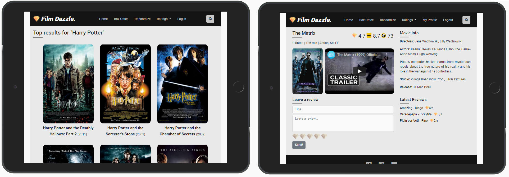

# [Film Dazzle.](https://filmdazzle.herokuapp.com/)

> A movie database website. Ratings, reviews and more.

---

---

## Purpose

This project is aimed at film enthusiasts eager to leave an opinion for a recently released title, as well as to the occasional viewer looking for a next film to enjoy. The site offers a custom rating system, generated from user reviews, the rating from IMDb and Metacritic. This application is completely free and there is no need to be a professional critic to leave a review or rate movies.

## Features

- The home page has a coming soon section for movies to be released, recently reviewed titles and a top 10 box office.
- Search movies by title, achieved with the OMDB API, later the titles are stored in MongoDB.
- A register and login to allow the user to fully interact with the site.
- Leave a review with a rating system, with full CRUD functionality.
- Randomize feature, allow the user to find a random title from the DB.
- A worldwide box office success ranking.
- A top 10 ranking by rating, according IMDb, Metacritic and Film Dazzle.

## Technologies Used

This website was developed mainly with **Python** and some **Javascript**.

Additionally, the next technologies were used:

- [Flask](https://flask.palletsprojects.com/)

  - This project uses **Flask** for routing.

- [Jinja](https://jinja.palletsprojects.com/en/2.11.x/)

  - This project uses **Jinja** as templating language.

- [PyMongo](https://pymongo.readthedocs.io/en/stable/)

  - This project uses **PyMongo** to handle the interaction between Python and MongoDB.

- [MongoDB](https://www.mongodb.com/)

  - This project uses **MongoBD** database to store all data.

- [Bootstrap](https://getbootstrap.com/)

  - This project uses **Bootstrap** to style layout and elements.

- [Sass](https://sass-lang.com/)

  - This project uses **SCSS** for styling.

- [JQuery](https://jquery.com)

  - This project uses **JQuery** to simplify DOM manipulation.

- [Heroku](https://www.heroku.com/)

  - This project uses **Heroku** to host the app.

#### Code Validation

For code validation [w3 Validation Service](https://w3.org/) was used for HTML and CSS. And [JSHint](https://jshint.com/) for JS.

#### The devices that this site was test were:

- Samsung Galaxy S6
- Samsung Galaxy A50
- Samsung Galaxy A70
- Iphone 8 Plus
- Laptop ASUS S510UA, 15.6"
- Desktop PC, 27"
- Tablet was tested with Chrome developer tools.
- Also, the site was tested on Firefox and Microsoft Edge.

## Contribute
All contributions are welcomed and encouraged.

### Deploy your own
To deploy this application on Heroku using GitHub and MongoDB follow this instruction:

- Clone the repository.
- Install the necessary dependencies using "pip3 install -r requirments.txt".
- Get a API key from [OMDb](http://www.omdbapi.com/)
- Get a API key from [YouTube Data API](https://developers.google.com/youtube/v3/getting-started)
- Create a [MongoDB](https://www.mongodb.com/) database with the same naming conventions which can be found in app.py. 
- Create a file in the main directory called ‘env.py’ based on the ‘env.example.py’ and add all your environment variables. Don’t forget to add a secret key for your app.
- Create a [Heroku](https://www.heroku.com/) app and connect it to your GitHub repo. In Heroku (App > Settings > GitHub) to complete the connection.
- Add your environment variables here as well, on the “Config Vars” section.
- Complete a commit, push it to GitHub and using ‘git push heroku master’ command push it to Heroku.

## Credits

- To [w3shools](https://www.w3schools.com/)
- To [MDN web docs](https://developer.mozilla.org/)
- To [Stack Overflow](https://stackoverflow.com/)
- To [OMDb API](http://www.omdbapi.com/)
- To [Font Awesome](https://fontawesome.com/)
- To [Pretty Printed](https://prettyprinted.com/)

#### Acknowledgements

I received inspiration for this project from:

- [IMDb](https://www.imdb.com/)
- [Rotten Tomatoes](https://www.rottentomatoes.com/)
- [Metacritic](https://www.metacritic.com/)
